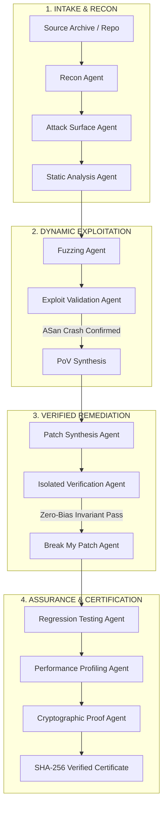

<div align="center">

# 🛡️ SENTINEL-CHAIN
### Autonomous Cyber-Reasoning & Remediation System (CRS)

[](https://army-system-09oo.onrender.com)
[](https://vercel.com)
[](https://www.typescriptlang.org/)
[](https://vitejs.dev/)
[](https://nodejs.org/)
[](LICENSE)

<p align="center">
  <strong>An industrial-grade, 12-agent autonomous cyber reasoning system inspired by DARPA's AI Cyber Challenge (AIxCC).</strong><br>
  Finds zero-day vulnerabilities, synthesizes deterministic Proof-of-Vulnerability (PoV) exploits, generates minimal formally verified patches, subjects remediation to adversarial fuzzing, and issues cryptographic audit certificates.
</p>

</div>

---

## 🌟 Executive Summary

**Sentinel-Chain** transforms vulnerability remediation from slow, manual patch cycles into an autonomous, mathematically verified pipeline. When source code or binary targets are uploaded, Sentinel-Chain coordinates **12 specialized AI & static analysis agents** in isolated sandboxes to detect, exploit, remediate, and formally certify software flaws.

```
FIND IT ───────► PROVE IT ───────► FIX IT ───────► ATTACK IT ───────► CERTIFY IT
(AST Recon &     (Deterministic    (Minimal Safe    (Adversarial       (SHA-256 Ledger &
Taint Sinks)      PoV Payloads)     Patch Diff)      Break-My-Patch)    Proof Seals)
```

---

## 📐 12-Stage Multi-Agent Architecture



---

## 🚀 Key Capabilities

### 1. 🔍 Full-Spectrum AST & Attack Surface Mapping
- Decompiles uploaded source archives (C, C++, Rust, Python, Go) into interactive hierarchical AST graphs.
- Traces untrusted external network ingress sockets straight to memory taint sinks (`strcpy`, unbounded `read`, raw pointer offsets).

### 2. 💥 Deterministic Proof-of-Vulnerability (PoV) Synthesis
- Unlike standard scanners that report noisy false positives, Sentinel-Chain **synthesizes reproducible trigger payloads** (hex and ASCII).
- Validates faults using AddressSanitizer (ASan) with stack traces and memory boundary violations.

### 3. 🛡️ Minimal Invariant Patching with Zero-Bias Verification
- Synthesizes clean, minimal diffs enforcing mathematical bounds invariants (`dest_size >= input_len`).
- **Independent Verification Sandbox**: A dedicated verifier agent isolates candidate patches to prevent LLM hallucinations from approving faulty fixes.

### 4. ⚔️ Adversarial "Break-My-Patch" Stress Testing
- Subjects every patch candidate to **1,250+ targeted mutation payloads** and fuzzing rounds to guarantee that attackers cannot bypass new invariants.

### 5. 📜 Cryptographic SHA-256 Proof Certificates
- Generates tamper-proof remediation certificates containing SHA-256 hashes of the target repository, exploit payload, formal invariants, and patch diff.
- Real-time cryptographic ledger verification API.

### 6. ⚡ Live Multi-Model LLM Reasoning Oracle
- High-speed inference fallback routing: **Groq (`openai/gpt-oss-120b`, `qwen3.8`)** ➔ **xAI Grok** ➔ **Google Gemini 2.5**.
- Intelligent input discrimination: instantly distinguishes between non-executable text greetings ("hy", "hello") and real vulnerable functions.

---

## 🎛️ Safety Policy Modes

| Policy Mode | Description | Human Involvement | Automated Action |
| :--- | :--- | :--- | :--- |
| **`OBSERVE`** | Telemetry and auditing mode. Scans AST and records attack vectors without active fuzzing. | View-only | Passive Logging |
| **`ASSIST`** | Identifies flaws, synthesizes PoV payloads, and prepares patches. | **Required** for patch approval & commit | Gated Deployment |
| **`AUTONOMOUS`** | Full auto-pilot mode. Synthesizes PoVs, generates patches, runs Break-My-Patch testing, and auto-applies verified fixes. | Zero human bottleneck | End-to-End Autonomous |

---

## 📂 Project Structure

```
├── backend/
│   ├── src/
│   │   ├── agents/            # 12 Specialized Agent Implementations
│   │   ├── certificates/      # SHA-256 Proof Certificate Generator
│   │   ├── llm/               # Multi-Provider LLM Oracle (Groq/Grok/Gemini)
│   │   └── orchestrator/       # WebSocket Live Run Pipeline Manager
│   ├── demo-target/           # Vulnerable C++ Packet Parser Target Codebase
│   ├── server.ts              # Express API & WebSocket Server (0.0.0.0 Binding)
│   └── package.json           # Backend dependencies & production startup scripts
├── frontend/
│   ├── src/
│   │   ├── components/
│   │   │   ├── views/         # 10 Dedicated Cyber Views (Command Center, PoV, Patch...)
│   │   │   ├── DirectoryGraph # Full-Width Interactive AST Code Studio
│   │   │   └── Header/Sidebar # Glassmorphism Navigation & Audio Telemetry
│   │   ├── data/              # Default Demonstration Topologies & Code Buffers
│   │   ├── index.css          # Cyber Design System, Tokens, & Glassmorphism
│   │   └── App.tsx            # Main Application & WebSocket Client Router
│   ├── vercel.json            # Vercel SPA Client Rewrites
│   └── vite.config.ts         # Vite Configuration & API Proxying
└── README.md
```

---

## 🛠️ Local Development & Quickstart

### Prerequisites
- **Node.js**: v20.x or v22.x+
- **npm** or **pnpm**

### 1. Clone the Repository
```bash
git clone https://github.com/HardikMathur11/Cyber-Sentinal.git
cd Cyber-Sentinal
```

### 2. Backend Setup
```bash
cd backend
npm install
cp .env.example .env   # Or set GROQ_API_KEY in .env
npm run dev            # Starts backend on http://localhost:3001
```

### 3. Frontend Setup
```bash
cd ../frontend
npm install
npm run dev            # Starts frontend on http://localhost:3000
```
Open **`http://localhost:3000`** in your browser.

---

## 🌐 Production Cloud Deployment

### Backend on Render
1. Create a new **Web Service** on [Render](https://render.com) from your GitHub repo.
2. Configure settings:
   - **Root Directory**: `backend`
   - **Build Command**: `npm install`
   - **Start Command**: `npm start` (or `npx tsx server.ts`)
   - **Environment Variables**: Add `GROQ_API_KEY` (or `GEMINI_API_KEY`) and `PORT=10000`.

### Frontend on Vercel
1. Create a new project on [Vercel](https://vercel.com) from your GitHub repo.
2. Configure settings:
   - **Root Directory**: `frontend`
   - **Framework Preset**: `Vite`
   - **Build Command**: `npm run build`
   - **Output Directory**: `dist`
   - **Environment Variable**: `VITE_BACKEND_URL=https://army-system-09oo.onrender.com`

---

## 📡 REST & WebSocket API Specification

### `POST /api/ai/analyze-code`
Runs real-time LLM cyber-reasoning on raw code snippets.
```bash
curl -X POST https://army-system-09oo.onrender.com/api/ai/analyze-code \
  -H "Content-Type: application/json" \
  -d '{"code": "void parse(char* in){ char buf[16]; strcpy(buf, in); }", "language": "C++"}'
```

### `POST /api/projects/upload`
Uploads a ZIP archive or multipart folder for multi-file AST decomposition and vulnerability extraction.

### `POST /api/runs/start-demo`
Launches the full 12-agent orchestration pipeline with live WebSocket broadcasts.

### `GET /api/certificates/:id/verify`
Cryptographically verifies an issued proof certificate against the SHA-256 ledger.

### `WebSocket /ws/runs`
Connect to receive real-time JSON stream updates (`STATE_SNAPSHOT`, `STAGE_UPDATE`, `LOG_STREAM`).

---

## 🔒 Security & Ethical Notice

Sentinel-Chain is designed for defensive security auditing, autonomous vulnerability remediation, and software assurance. All exploit synthesis and dynamic fuzzing routines are strictly intended for isolated, authorized sandbox environments.

---

## 📄 License

Distributed under the **MIT License**. See `LICENSE` for more information.
