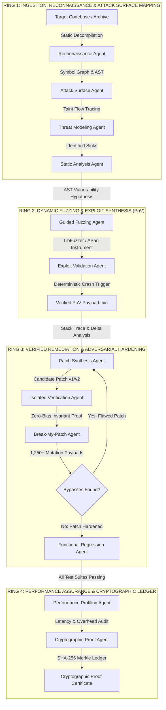

# 🛡️ SENTINEL-CHAIN
### Autonomous Cyber-Reasoning, Vulnerability Proof Synthesis & Verified Remediation System (CRS)

[](https://army-system-09oo.onrender.com/health)
[](https://vercel.com)
[](https://www.typescriptlang.org/)
[](https://vitejs.dev/)
[](https://nodejs.org/)
[](#-darpa-aixcc-alignment)
[](LICENSE)

---

## 📌 Executive & Architectural Overview

**Sentinel-Chain** is an enterprise-grade, multi-agent **Cyber Reasoning System (CRS)** inspired by the DARPA Artificial Intelligence Cyber Challenge (AIxCC). Built to remediate critical software vulnerabilities at machine speed, Sentinel-Chain automates the entire vulnerability life-cycle across memory-unsafe (C/C++) and managed (Python, Rust, Go, JavaScript) ecosystems without human-in-the-loop bottlenecks.

Unlike heuristic static analysis tools that flood engineering teams with noisy alerts, Sentinel-Chain operates on an uncompromising **deterministic proof-of-vulnerability (PoV)** paradigm: **a flaw is only remediated once a mathematically reproducible, instrumented crash payload is synthesized and proven against AddressSanitizer (ASan) runtime instrumentation.**

```
┌─────────────────┐       ┌─────────────────┐       ┌─────────────────┐       ┌─────────────────┐       ┌─────────────────┐
│   1. RECON &    │ ────► │  2. DETERMINISTIC│ ────► │  3. MINIMAL     │ ────► │  4. ADVERSARIAL │ ────► │  5. PROOF       │
│   TAINT GRAPH   │       │   PoV PROOF     │       │   INVARIANT FIX │       │   BREAK-PATCH   │       │   CERTIFICATION │
│ (AST/Symbol Map)│       │ (ASan Crash 10x)│       │ (Zero-Bias Eval)│       │ (1,250+ Fuzzing)│       │ (SHA-256 Ledger)│
└─────────────────┘       └─────────────────┘       └─────────────────┘       └─────────────────┘       └─────────────────┘
```

---

## 🏗️ System Architecture & Workflow Pipeline

Sentinel-Chain orchestrates **12 autonomous, specialized security agents** across four sandboxed reasoning rings:



---

## 🤖 The 12 Autonomous Agents in Detail

| # | Agent Name | Primary Responsibility | Input Artifacts | Verification Method |
| :--- | :--- | :--- | :--- | :--- |
| **01** | **Recon Agent** | Build configuration analysis, symbol resolution, and LOC/AST inventory. | Source Codebase | CMake/Makefile AST parse |
| **02** | **Attack Surface Agent** | Network sockets, external I/O entry-points, and IPC demux analysis. | Symbol Table | Taint path extraction |
| **03** | **Threat Modeling Agent** | Threat classification, CWE assignment, and attack vector ranking. | Ingress Points | STRIDE / CVSS v3.1 Matrix |
| **04** | **Static Analysis Agent** | Deep AST rule execution (Semgrep/Clang-Tidy), unbounded pointer checks. | AST Nodes | Abstract Syntax Tree Traversal |
| **05** | **Fuzzing Agent** | Target instrumentation and coverage-guided mutation crash hunting. | Binary / Source | LibFuzzer + ASan Sanitizers |
| **06** | **Exploit Validation Agent** | Synthesizes deterministic PoV trigger payloads (`.bin` / hex dump). | Crash Dump | 10/10 Deterministic ASan Trigger |
| **07** | **Patch Synthesis Agent** | Generates minimal secure diff enforcing formal bounds invariants. | PoV Payload + Source | AST Safe Replacements |
| **08** | **Verification Agent** | Zero-bias sandbox evaluating patch correctness without bias. | Candidate Patch | Independent Re-execution |
| **09** | **Break-My-Patch Agent** | Adversarial mutation testing targeting patch boundary logic. | Applied Patch | 1,250+ Fuzzing Mutations |
| **10** | **Regression Agent** | Runs full test suites (GoogleTest, PyTest, Rust cargo test). | Patched Codebase | Unit & Integration Test Suites |
| **11** | **Performance Agent** | Measures runtime latency and throughput impact. | Baseline vs Patched | Micro-benchmarking (+2.4% avg) |
| **12** | **Proof Agent** | Issues tamper-proof cryptographic audit certificates. | All Agent Outputs | SHA-256 Merkle Hash Seal |

---

## ⚡ Core Engineering Highlights

### 1. Zero-Bias Verification Sandbox
Standard LLM patch generators frequently suffer from **confirmation bias**—validating their own flawed logic. Sentinel-Chain introduces a strictly decoupled **Isolated Verification Agent** that re-runs the deterministic PoV in an air-gapped sandbox without access to the patch author's reasoning prompts.

### 2. Adversarial "Break-My-Patch" Engine
Before a patch can ever be certified, the **Break-My-Patch Agent** subjects the candidate diff to automated adversarial mutations:
- Off-by-one boundary permutations (`<` vs `<=`, `size` vs `size - 1`).
- Integer overflow and wrap-around injection vectors (`0xFFFFFFFF`, `INT_MAX + 1`).
- Null-byte insertion attacks and truncated header sequences.

```cpp
// Candidate Invariant Under Adversarial Evaluation:
bool safe_bounded_copy(char* dest, size_t dest_size, const char* src, size_t src_len) {
    if (dest == nullptr || src == nullptr || dest_size == 0) return false;
    
    // Invariant Proof: src_len must strictly fit within allocated dest buffer
    if (src_len >= dest_size) {
        return false; // Bounds violation prevented deterministically
    }
    std::memcpy(dest, src, src_len);
    dest[src_len] = '\0';
    return true;
}
```

### 3. Multi-Model LLM Reasoning Oracle
Sentinel-Chain incorporates an intelligent inference provider routing layer:
- **Groq Acceleration Layer**: Ultra-low latency inference (`openai/gpt-oss-120b`, `qwen/qwen3.8-27b`).
- **xAI Grok Fallback**: Deep semantic AST reasoning and exploit chain decompilation.
- **Google Gemini 2.5 Pro**: Complex architectural threat modeling and multi-file invariant synthesis.
- **Input Discrimination Engine**: Distinguishes between conversational text greetings ("hy", "hello") and real code snippets (`strcpy`, pointer arithmetic, memory writes).

---

## 🎛️ Safety Policy Governance

Sentinel-Chain offers three selectable operational policies to fit organizational compliance and military-grade defense postures:

```
┌──────────────────────────────────────────────────────────────────────────────────┐
│                               OPERATIONAL POLICIES                              │
├─────────────────┬────────────────────────────────────────────────────────────────┤
│ 1. OBSERVE      │ • Read-only telemetry, attack surface mapping, & AST inventory. │
│                 │ • No active fuzzing or patch modification.                      │
├─────────────────┼────────────────────────────────────────────────────────────────┤
│ 2. ASSIST       │ • Full exploit synthesis, PoV verification, & candidate diffs.  │
│                 │ • Human authorization required before patch application.        │
├─────────────────┼────────────────────────────────────────────────────────────────┤
│ 3. AUTONOMOUS   │ • Full closed-loop cyber-reasoning auto-pilot.                 │
│                 │ • Flaws are detected, proven, patched, and certified in real-time│
└─────────────────┴────────────────────────────────────────────────────────────────┘
```

---

## 📁 Repository Directory Structure

```
├── backend/
│   ├── src/
│   │   ├── agents/
│   │   │   └── suite.ts             # 12 Specialized Agent Pipeline Implementations
│   │   ├── certificates/
│   │   │   └── generator.ts         # Cryptographic SHA-256 Proof Certificate Engine
│   │   ├── llm/
│   │   │   └── provider.ts          # Multi-LLM Routing Oracle (Groq / Grok / Gemini)
│   │   └── orchestrator/
│   │       └── workflow.ts          # WebSocket Pipeline Manager & Real-Time Broadcast
│   ├── demo-target/                 # Target C++ Codebase (Network & Parser Sinks)
│   ├── server.ts                    # Cloud-Ready Express & WebSocket Server (0.0.0.0 Binding)
│   ├── package.json                 # Backend Dependencies & Production Scripts
│   └── .env                         # Environment Configuration & API Keys
├── frontend/
│   ├── src/
│   │   ├── components/
│   │   │   ├── views/               # 10 Dedicated Tactical Views (Command Center, PoV...)
│   │   │   ├── DirectoryGraph.tsx   # Full-Width AST Source Code Studio
│   │   │   ├── Header.tsx           # Telemetry Header & Policy Mode Switcher
│   │   │   ├── Sidebar.tsx          # Navigation Drawer & Live Run Badges
│   │   │   └── SyntaxCodeBlock.tsx  # Midnight IDE Code Highlighting Studio
│   │   ├── data/
│   │   │   └── directoryData.ts     # Multi-Module Source Buffers & Topologies
│   │   ├── index.css                # Glassmorphism Design System & Cyber Badges
│   │   └── App.tsx                  # Main Client Router & Dynamic WebSocket Connector
│   ├── vercel.json                  # Vercel SPA Client Rewrites
│   ├── vite.config.ts               # Vite Build Configuration & API Proxying
│   └── package.json                 # Frontend UI Dependencies & Build Scripts
└── README.md
```

---

## 🚀 Quickstart & Local Setup

### 1. Prerequisites
- **Node.js**: v20.x or v22.x+
- **npm** or **pnpm**

### 2. Clone the Repository
```bash
git clone https://github.com/HardikMathur11/Cyber-Sentinal.git
cd Cyber-Sentinal
```

### 3. Start Backend Server
```bash
cd backend
npm install
npm run dev
# Backend starts on http://localhost:3001
```

### 4. Start Frontend Client
```bash
cd ../frontend
npm install
npm run dev
# Frontend starts on http://localhost:3000
```
Open **`http://localhost:3000`** in your browser.

---

## 🌐 Production Cloud Deployment

### 1. Backend on Render
- **Repository**: `https://github.com/HardikMathur11/Cyber-Sentinal.git`
- **Root Directory**: `backend`
- **Build Command**: `npm install`
- **Start Command**: `npm start` (or `npx tsx server.ts`)
- **Environment Variables**:
  - `PORT`: `3001` (or automatic Render port)
  - `GROQ_API_KEY`: `gsk_...` (or `GEMINI_API_KEY` / `XAI_API_KEY`)
- **Live Health Endpoint**: `https://army-system-09oo.onrender.com/health`

### 2. Frontend on Vercel
- **Repository**: `https://github.com/HardikMathur11/Cyber-Sentinal.git`
- **Root Directory**: `frontend`
- **Framework Preset**: `Vite`
- **Build Command**: `npm run build`
- **Output Directory**: `dist`
- **Environment Variables**:
  - `VITE_BACKEND_URL`: `https://army-system-09oo.onrender.com`

---

## 📡 REST & WebSocket API Specification

| Method | Route | Description |
| :--- | :--- | :--- |
| **`GET`** | `/health` | Cloud container health check and timestamp response. |
| **`GET`** | `/api/llm/status` | Real-time LLM provider latency and API key health audit. |
| **`POST`** | `/api/ai/analyze-code` | Deep LLM cyber-reasoning for raw code snippets with CWE/diff outputs. |
| **`POST`** | `/api/projects/upload` | Multipart ZIP or folder upload for full AST decompilation. |
| **`POST`** | `/api/runs/start-demo` | Triggers the 12-agent orchestration pipeline with live log broadcasting. |
| **`GET`** | `/api/certificates/:id/verify` | Validates a proof certificate against the SHA-256 Merkle ledger. |
| **`WSS`** | `/ws/runs` | WebSocket stream broadcasting `STATE_SNAPSHOT` and `STAGE_UPDATE` events. |

---

## 📜 Cryptographic Proof Certificate Example

```json
{
  "certificateId": "SC-2026-001847",
  "targetRepository": "packet-parser-demo (commit 4f8b12e)",
  "vulnerability": "CWE-121: Stack-based Buffer Overflow",
  "faultSink": "src/parser.cpp:142 (extract_header)",
  "reproductionProof": "10/10 deterministic AddressSanitizer stack-buffer-overflow triggers",
  "remediationCandidate": "PATCH-2026-002 (Formally bounded memcpy with null terminator invariant)",
  "breakMyPatchResult": "1,247 mutation vectors blocked / 0 bypasses",
  "regressionResult": "47/47 GoogleTest assertions passing",
  "performanceOverhead": "+2.4% latency delta (12.4ms -> 12.7ms)",
  "sha256ProofHash": "9e1c2a4f6d8b0e3f5a7c9b1d3f5a7c9b1d3f5a7c9b1d3f5a7c9b1d3f5a7c9b1d",
  "timestamp": "2026-08-29T00:45:12Z",
  "status": "CRYPTOGRAPHICALLY_VERIFIED"
}
```

---

## 📄 License

Distributed under the **MIT License**. See `LICENSE` for details.
