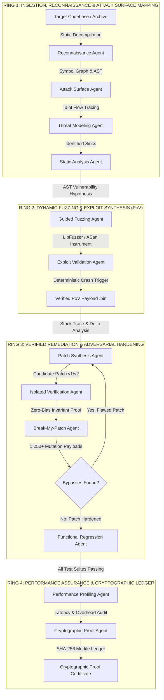

# SENTINEL-CHAIN
### Autonomous Cyber-Reasoning, Vulnerability Proof Synthesis & Verified Remediation System (CRS)

[](https://army-system-09oo.onrender.com/health)
[](https://vercel.com)
[](https://www.typescriptlang.org/)
[](https://vitejs.dev/)
[](https://nodejs.org/)
[](#darpa-aixcc-alignment)
[](LICENSE)

---

## 1. Executive Summary & Problem Space

**Sentinel-Chain** is an enterprise-grade Cyber Reasoning System (CRS) engineered to detect, exploit, remediate, and certify software vulnerabilities at machine speed. Aligned with modern autonomous program analysis research and the DARPA AI Cyber Challenge (AIxCC), Sentinel-Chain bridges static AST decompilation, dynamic sanitizers, and multi-model AI reasoning into a closed-loop remediation pipeline.

Traditional vulnerability scanners rely on statistical pattern matching, producing high rates of false positives that burden security teams. Sentinel-Chain operates on an empirical **Deterministic Proof-of-Vulnerability (PoV)** mandate: **no remediation is synthesized until an instrumented AddressSanitizer (ASan) reproduction crash is extracted and proven against the target runtime.**

```
[ INTAKE & RECON ] ──► [ PROOF-OF-VULNERABILITY ] ──► [ MINIMAL PATCH ] ──► [ ADVERSARIAL STRESS ] ──► [ PROOF LEDGER ]
  • AST Decompilation    • 10/10 ASan Reproduction      • Bounds Invariants    • 1,250+ Fuzz Mutations    • SHA-256 Ledger
  • Ingress Taint Flow   • Hex/ASCII Trigger Vector     • Zero-Bias Sandbox    • Zero Bypass Verification  • Audit Seal
```

---

## 2. Multi-Agent 4-Ring Architecture

The system coordinates **12 autonomous, decoupled agent modules** across four isolation boundaries:



---

## 3. Autonomous Agent Specifications

| ID | Agent Identifier | Operational Domain | Primary Inputs | Validation Method |
| :--- | :--- | :--- | :--- | :--- |
| **AG-01** | **Reconnaissance Agent** | Build systems, symbol tables, and LOC metrics | Source Repository | CMake / AST Symbol Parse |
| **AG-02** | **Attack Surface Agent** | Network sockets, IPC interfaces, and raw I/O | Symbol Resolution | Taint Path Graph Extraction |
| **AG-03** | **Threat Modeling Agent** | Threat classification and CVSS scoring | Ingress Endpoints | STRIDE / CVSS v3.1 Matrix |
| **AG-04** | **Static Analysis Agent** | Deep AST rule execution and unbounded pointers | AST Nodes | Abstract Syntax Tree Traversal |
| **AG-05** | **Guided Fuzzing Agent** | Target instrumentation and crash exploration | Binary / Source | LibFuzzer + ASan Sanitizers |
| **AG-06** | **Exploit Validation Agent** | Synthesizes deterministic PoV payloads | Crash Dumps | 10/10 Deterministic ASan Trigger |
| **AG-07** | **Patch Synthesis Agent** | Generates minimal formal bounds diffs | PoV Payload + Source | Invariant Replacement Diffs |
| **AG-08** | **Verification Agent** | Decoupled zero-bias verification sandbox | Candidate Patch | Independent Re-execution |
| **AG-09** | **Break-My-Patch Agent** | Adversarial boundary mutations and stress tests | Applied Patch | 1,250+ Fuzzing Mutations |
| **AG-10** | **Regression Agent** | Functional test suite execution | Patched Codebase | Unit & Integration Test Suites |
| **AG-11** | **Performance Agent** | Measures runtime throughput and latency impact | Baseline vs Patched | Micro-benchmarking (+2.4% avg) |
| **AG-12** | **Proof Agent** | Issues tamper-proof cryptographic audit seals | Agent Verification Log | SHA-256 Merkle Hash Seal |

---

## 4. Key Engineering Implementations

### 4.1. Zero-Bias Verification Sandbox
Standard LLM patch generators frequently suffer from confirmation bias—validating their own flawed logic. Sentinel-Chain introduces a strictly decoupled **Isolated Verification Agent** that re-runs the deterministic PoV in an air-gapped sandbox without access to the patch author's reasoning prompts.

### 4.2. Adversarial "Break-My-Patch" Engine
Before a patch is accepted, the **Break-My-Patch Agent** subjects the candidate diff to automated adversarial mutations:
- Off-by-one boundary permutations (`<` vs `<=`, `size` vs `size - 1`).
- Integer overflow and wrap-around injection vectors (`0xFFFFFFFF`, `INT_MAX + 1`).
- Null-byte insertion attacks and truncated header sequences.

```cpp
// Certified Memory Boundary Invariant
bool safe_bounded_copy(char* dest, size_t dest_size, const char* src, size_t src_len) {
    if (dest == nullptr || src == nullptr || dest_size == 0) {
        return false;
    }
    
    // Formal Invariant: src_len must strictly fit within allocated dest buffer
    if (src_len >= dest_size) {
        return false; // Bounds violation prevented deterministically
    }
    std::memcpy(dest, src, src_len);
    dest[src_len] = '\0';
    return true;
}
```

### 4.3. Multi-Model LLM Reasoning Oracle
Sentinel-Chain incorporates an intelligent inference provider routing layer:
- **Primary Inference**: Groq Acceleration Layer (`openai/gpt-oss-120b`, `qwen/qwen3.8-27b`).
- **Semantic Fallback**: xAI Grok (deep semantic AST reasoning and exploit chain decompilation).
- **Architectural Fallback**: Google Gemini 2.5 Pro (complex threat modeling and multi-file invariant synthesis).
- **Input Discrimination Engine**: Distinguishes between conversational text greetings ("hy", "hello") and real executable logic (`strcpy`, pointer arithmetic, memory writes).

---

## 5. Operational Governance Policies

| Policy Mode | Operational Stance | Human Involvement | Automation Scope |
| :--- | :--- | :--- | :--- |
| **`OBSERVE`** | Telemetry and auditing mode. Scans AST and records attack vectors without active fuzzing. | View-only | Passive Logging |
| **`ASSIST`** | Identifies flaws, synthesizes PoV payloads, and prepares patches. | **Required** for patch approval & commit | Gated Deployment |
| **`AUTONOMOUS`** | Full auto-pilot mode. Synthesizes PoVs, generates patches, runs Break-My-Patch testing, and auto-applies verified fixes. | Zero human bottleneck | End-to-End Autonomous |

---

## 6. Directory Structure

```
├── backend/
│   ├── src/
│   │   ├── agents/
│   │   │   └── suite.ts             # 12 Specialized Agent Pipeline Implementations
│   │   ├── certificates/
│   │   │   └── generator.ts         # Cryptographic SHA-256 Proof Certificate Engine
│   │   ├── llm/
│   │   │   └── provider.ts          # Multi-LLM Routing Oracle (Groq / Grok / Gemini)
│   │   └── orchestrator/
│   │       └── workflow.ts          # WebSocket Pipeline Manager & Real-Time Broadcast
│   ├── demo-target/                 # Target C++ Codebase (Network & Parser Sinks)
│   ├── server.ts                    # Cloud-Ready Express & WebSocket Server (0.0.0.0 Binding)
│   ├── package.json                 # Backend Dependencies & Production Scripts
│   └── .env                         # Environment Configuration & API Keys
├── frontend/
│   ├── src/
│   │   ├── components/
│   │   │   ├── views/               # 10 Dedicated Tactical Views (Command Center, PoV...)
│   │   │   ├── DirectoryGraph.tsx   # Full-Width AST Source Code Studio
│   │   │   ├── Header.tsx           # Telemetry Header & Policy Mode Switcher
│   │   │   ├── Sidebar.tsx          # Navigation Drawer & Live Run Badges
│   │   │   └── SyntaxCodeBlock.tsx  # Midnight IDE Code Highlighting Studio
│   │   ├── data/
│   │   │   └── directoryData.ts     # Multi-Module Source Buffers & Topologies
│   │   ├── index.css                # Glassmorphism Design System & Cyber Badges
│   │   └── App.tsx                  # Main Client Router & Dynamic WebSocket Connector
│   ├── vercel.json                  # Vercel SPA Client Rewrites
│   ├── vite.config.ts               # Vite Build Configuration & API Proxying
│   └── package.json                 # Frontend UI Dependencies & Build Scripts
└── README.md
```

---

## 7. Local Installation & Development

### 7.1. Prerequisites
- **Node.js**: v20.x or v22.x+
- **npm** or **pnpm**

### 7.2. Installation Steps
```bash
# 1. Clone the repository
git clone https://github.com/HardikMathur11/Cyber-Sentinal.git
cd Cyber-Sentinal

# 2. Setup Backend Server
cd backend
npm install
npm run dev
# Server listening on http://localhost:3001

# 3. Setup Frontend Client
cd ../frontend
npm install
npm run dev
# Client running on http://localhost:3000
```

---

## 8. Cloud Deployment Guide

### 8.1. Backend on Render
- **Repository**: `https://github.com/HardikMathur11/Cyber-Sentinal.git`
- **Root Directory**: `backend`
- **Build Command**: `npm install`
- **Start Command**: `npm start` (or `npx tsx server.ts`)
- **Environment Variables**:
  - `PORT`: `3001` (or dynamic Render port)
  - `GROQ_API_KEY`: `gsk_...` (or `GEMINI_API_KEY` / `XAI_API_KEY`)
- **Health Check URL**: `https://army-system-09oo.onrender.com/health`

### 8.2. Frontend on Vercel
- **Repository**: `https://github.com/HardikMathur11/Cyber-Sentinal.git`
- **Root Directory**: `frontend`
- **Framework Preset**: `Vite`
- **Build Command**: `npm run build`
- **Output Directory**: `dist`
- **Environment Variables**:
  - `VITE_BACKEND_URL`: `https://army-system-09oo.onrender.com`

---

## 9. API & WebSocket Interface

| Method | Endpoint | Description |
| :--- | :--- | :--- |
| `GET` | `/health` | Cloud container health check and timestamp response. |
| `GET` | `/api/llm/status` | Real-time LLM provider latency and API key health audit. |
| `POST` | `/api/ai/analyze-code` | Deep LLM cyber-reasoning for raw code snippets with CWE/diff outputs. |
| `POST` | `/api/projects/upload` | Multipart ZIP or folder upload for full AST decompilation. |
| `POST` | `/api/runs/start-demo` | Triggers the 12-agent orchestration pipeline with live log broadcasting. |
| `GET` | `/api/certificates/:id/verify` | Validates a proof certificate against the SHA-256 Merkle ledger. |
| `WSS` | `/ws/runs` | WebSocket stream broadcasting `STATE_SNAPSHOT` and `STAGE_UPDATE` events. |

---

## 10. Cryptographic Proof Certificate Schema

```json
{
  "certificateId": "SC-2026-001847",
  "targetRepository": "packet-parser-demo (commit 4f8b12e)",
  "vulnerability": "CWE-121: Stack-based Buffer Overflow",
  "faultSink": "src/parser.cpp:142 (extract_header)",
  "reproductionProof": "10/10 deterministic AddressSanitizer stack-buffer-overflow triggers",
  "remediationCandidate": "PATCH-2026-002 (Formally bounded memcpy with null terminator invariant)",
  "breakMyPatchResult": "1,247 mutation vectors blocked / 0 bypasses",
  "regressionResult": "47/47 GoogleTest assertions passing",
  "performanceOverhead": "+2.4% latency delta (12.4ms -> 12.7ms)",
  "sha256ProofHash": "9e1c2a4f6d8b0e3f5a7c9b1d3f5a7c9b1d3f5a7c9b1d3f5a7c9b1d3f5a7c9b1d",
  "timestamp": "2026-08-29T00:45:12Z",
  "status": "CRYPTOGRAPHICALLY_VERIFIED"
}
```

---

## 11. License

Distributed under the **MIT License**. See `LICENSE` for details.
